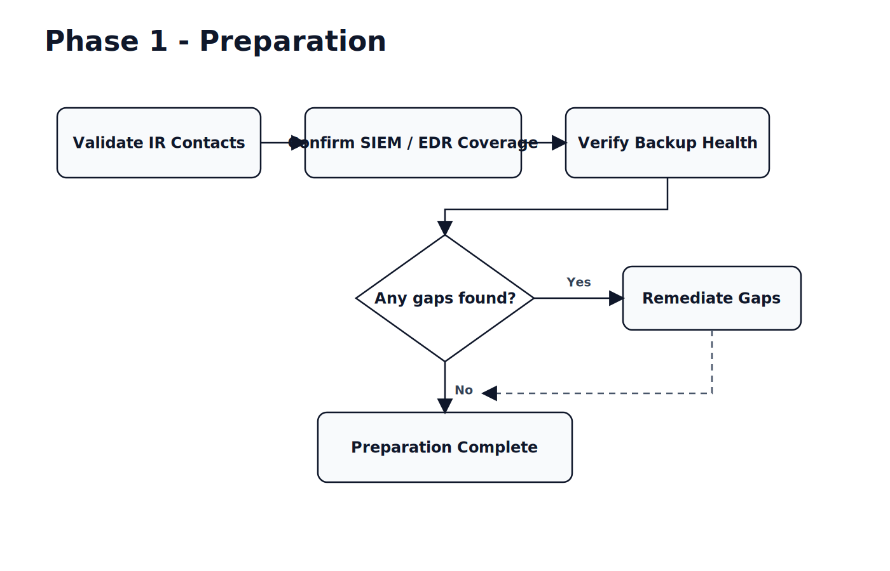
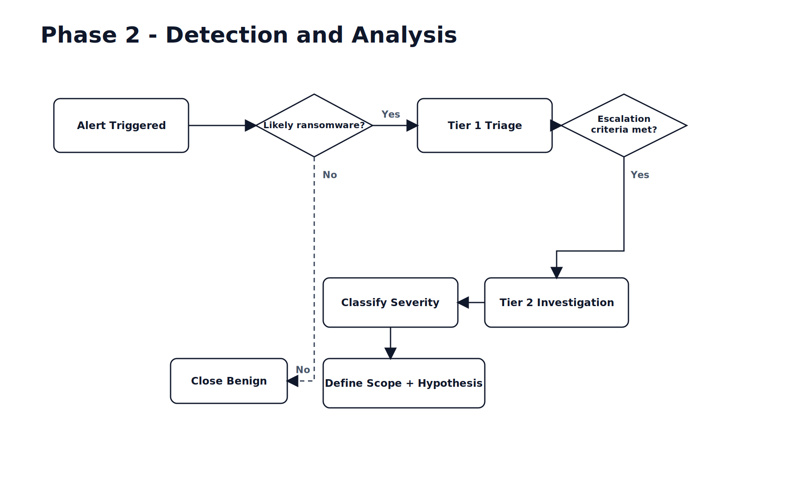
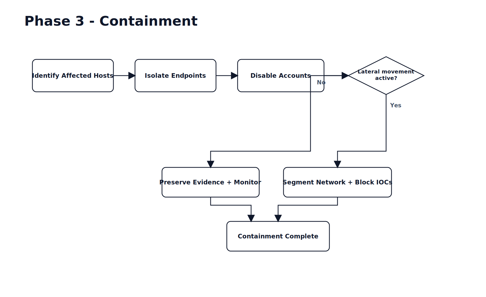
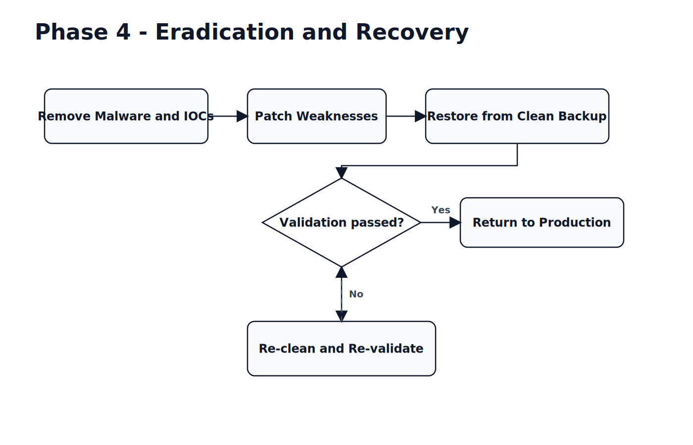
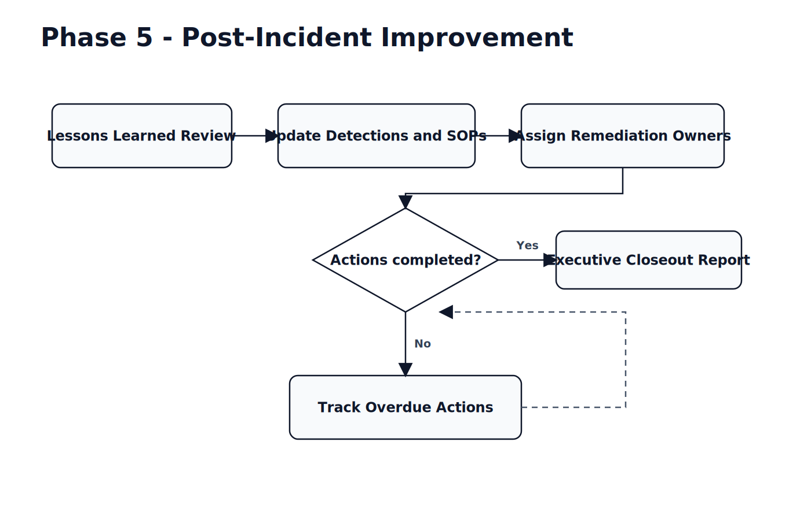

# SOC Ransomware Incident Response Playbook

## 1) Purpose
Standardize how the SOC detects, escalates, contains, and recovers from ransomware events using clear Tier 1 and Tier 2 responsibilities, objective escalation criteria, and repeatable communications.

## 2) Scope
- **In scope:** suspected or confirmed ransomware across endpoints, servers, identity systems, storage, and backups.
- **Out of scope:** non-malware availability incidents unless ransomware indicators are present.
- **Users:** SOC Tier 1, SOC Tier 2, Incident Commander (IC), IT Ops, Identity, Legal/Compliance, Communications/PR, Leadership.

## 3) Severity Model
- **SEV-1 (Critical):** active encryption on critical systems, domain compromise, backup impact, or regulatory/customer impact likely.
- **SEV-2 (High):** confirmed ransomware behavior on limited hosts, no critical service outage yet.
- **SEV-3 (Medium):** suspicious indicators with no confirmed encryption/exfiltration.
- **SEV-4 (Low):** false positive or informational.

## 4) Tiered SOC Roles

### Tier 1 Analyst (Monitor, Triage, Escalate)
- Validate alert quality, collect basic evidence (host, user, process, hash, network, time).
- Run first-pass checks in SIEM/EDR/email gateway/proxy.
- Apply approved immediate controls (host isolate, account disable) if criteria are met.
- Open and update incident ticket with timeline and artifacts.
- Escalate to Tier 2 when trigger conditions are met (section 6).
- Execute communication templates for initial notification and handoff.

### Tier 2 Analyst (Investigate, Contain, Coordinate)
- Perform deep analysis: kill chain, patient zero, spread path, and exfiltration indicators.
- Lead containment strategy with IT/Identity teams.
- Hunt for IOCs and related compromised assets.
- Validate eradication and recovery safety before reintroduction to production.
- Recommend severity changes and legal/compliance escalation.
- Produce technical incident report and detection improvements.

### Incident Commander (often Tier 2 Lead or SOC Manager)
- Owns decision-making, priority, and cross-team coordination.
- Approves business-risk tradeoffs and executive updates.
- Authorizes transition between phases and incident closure.

## 5) Response Workflow by Phase

### Phase 1: Preparation


**Tier 1**
- Confirm monitoring health and alert routing.
- Verify contact trees and on-call coverage.

**Tier 2**
- Validate ransomware detection logic and hunt queries.
- Ensure containment scripts and IOC block workflows are current.

**Exit criteria**
- Monitoring and on-call validated, backup verification status known, runbook current.

### Phase 2: Detection and Analysis


**Tier 1**
- Triage alert within SLA (`<= 15 min` for SEV-1/2 candidate).
- Collect minimum evidence bundle:
  - hostname/IP, user/account, process tree, command line
  - file extension/encryption indicators
  - known ransomware notes/hash matches
  - authentication anomalies and C2 traffic
- Assign preliminary severity.

**Tier 2**
- Confirm ransomware family/TTP alignment.
- Determine blast radius and potential data exposure.
- Decide if escalation to IC/legal/compliance is required.

**Exit criteria**
- Incident classified, severity assigned, escalation path activated, scope hypothesis documented.

### Phase 3: Containment


**Tier 1**
- Execute approved immediate actions:
  - isolate affected endpoint(s)
  - disable suspected compromised account(s)
  - add temporary IOC blocks per playbook
- Track all actions in timestamped incident timeline.

**Tier 2**
- Confirm lateral movement and expand containment boundaries.
- Coordinate network segmentation, identity hardening, privileged credential resets.
- Preserve forensic evidence (memory/disk/logs) before destructive actions when feasible.

**Exit criteria**
- No active encryption spread, critical assets protected, containment boundaries stable.

### Phase 4: Eradication and Recovery


**Tier 1**
- Validate endpoint health checks and monitoring for re-infection signals.
- Continue IOC monitoring and alert tuning.

**Tier 2**
- Remove persistence, close exploited vector, and patch vulnerabilities.
- Validate clean restore from trusted backups.
- Approve staged return to production with enhanced monitoring.

**Exit criteria**
- Compromise artifacts removed, vulnerable path remediated, restored systems validated.

### Phase 5: Post-Incident Improvement


**Tier 1**
- Update triage checklist and knowledge base.
- Share analyst notes on missed/late signals.

**Tier 2**
- Complete root cause analysis and detection gap review.
- Define corrective actions with owners and due dates.

**Exit criteria**
- Post-incident report delivered, actions tracked, rule updates implemented.

## 6) Escalation Criteria (Tier 1 -> Tier 2/IC)
Escalate immediately if **any** of the following are true:

- Encryption behavior confirmed (mass file rename/encryption extension/ransom note).
- Same indicator observed on `>= 2` hosts in `<= 30 min`.
- Domain admin/service account abuse suspected.
- Backup repositories, hypervisors, or identity infrastructure touched.
- Data exfiltration indicators present (archive + outbound transfer, unusual cloud uploads).
- Critical business service degraded/unavailable.
- Threat actor persistence or active C2 beaconing detected.
- Legal/regulatory trigger likely (PII/PHI/payment data exposure).

### Escalation Timing Targets
- **Tier 1 triage start:** within 15 minutes of high-confidence alert.
- **Tier 2 engagement:** within 15 minutes after trigger criteria met.
- **Incident Commander engaged:** within 30 minutes for SEV-1.
- **Executive notification:** within 60 minutes for confirmed SEV-1.

## 7) Communication Templates

### A) Initial SOC Internal Alert (Tier 1 -> Tier 2/IC)
**Channel:** SOC chat + incident platform  
**When:** immediately after escalation criteria met

```text
Subject: [SEV-{1|2}] Suspected Ransomware - {Business Unit/System}

Time detected: {UTC/local}
Detection source: {SIEM/EDR/use case}
Affected assets (known): {hostnames/users/IPs}
Key indicators: {extensions/ransom note/process/hash/C2}
Immediate actions taken: {isolation/account disable/block}
Current impact: {service/customer/regulatory known or unknown}
Requested support: Tier 2 investigation and containment lead
Ticket/bridge: {link}
```

### B) IT Operations Containment Request
**Channel:** bridge + ticket assignment

```text
Priority: P1 Security Incident - Ransomware Containment Request

Please execute within {X} minutes:
1) Isolate endpoints: {list}
2) Block IOCs: {domains/IPs/hashes}
3) Disable/reset accounts: {list}
4) Confirm completion in ticket: {ticket#}

Business impact if delayed: potential lateral spread/encryption expansion.
SOC POC: {name/contact}
```

### C) Executive Update (IC -> Leadership)
**Channel:** email + leadership bridge

```text
Subject: [SEV-1] Ransomware Incident Update #{N} - {Org/Environment}

Status: {Investigating | Contained | Recovering}
What happened: {1-2 sentence plain-language summary}
Current impact: {systems, users, service status}
Risk assessment: {data exposure likelihood, business risk}
Actions completed: {top 3}
Next actions (next 2-4 hours): {top 3}
Decisions needed: {if any}
Next update ETA: {time}
```

### D) Legal/Compliance Notification Trigger Message
**Channel:** secure legal channel

```text
Potential breach notification trigger identified.
Incident: {ticket/link}
Data at risk: {PII/PHI/PCI/unknown}
Evidence summary: {what indicates possible exfiltration}
Request: legal hold + regulatory notification guidance.
```

### E) Shift Handoff Template (SOC)
**Channel:** incident ticket + SOC handoff channel

```text
Incident: {ticket#} | Severity: {SEV}
Current phase: {Detection/Containment/Recovery/Post-incident}
What changed this shift: {highlights}
Open hypotheses: {list}
Pending actions: {owner + ETA}
Risks/blockers: {list}
Next checkpoint: {time}
```

## 8) Evidence Collection Minimums
- EDR telemetry export (process tree, parent-child lineage, hashes).
- Authentication logs (IAM/AD, privileged account activity).
- Network telemetry (DNS, proxy, firewall, east-west if available).
- File and backup access events.
- Ticket timeline with all command/action timestamps.

## 9) KPIs to Measure Playbook Performance
- Mean time to triage (MTTT).
- Mean time to contain (MTTC).
- Time from first alert to Tier 2 escalation.
- Percentage of incidents with complete evidence bundle.
- Repeat incident rate from same root cause.

## 10) Approval and Maintenance
- **Owner:** SOC Manager
- **Review cadence:** every 90 days or after any SEV-1 ransomware event
- **Version:** 1.0
- **Last updated:** 2026-03-12
